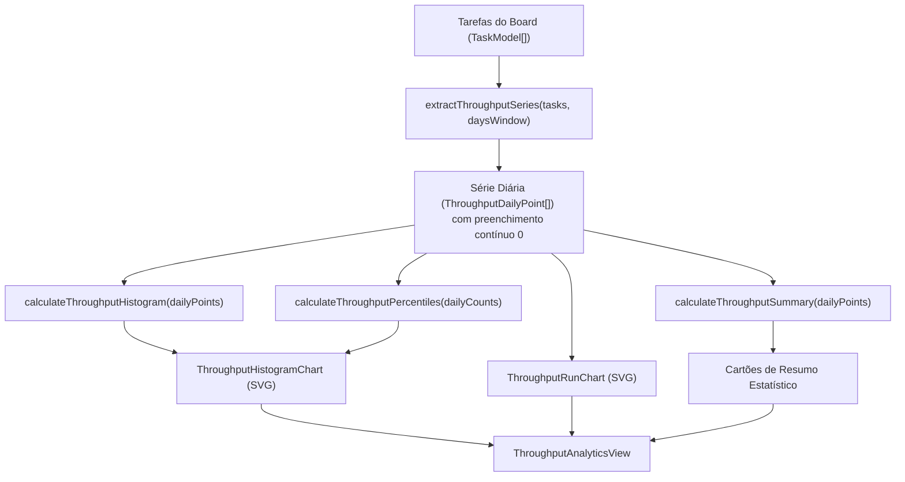

# Data Model & Architecture: Feature 021 - Gráfico de Vazão Avançado com Histograma e Linha do Tempo (Throughput Analytics)

**Feature**: `021-throughput-histogram-timeline` | **Date**: 2026-09-11

---

## 1. Estruturas de Entidades e Tipos de Dados

### 1.1 `ThroughputDailyPoint` (Amostra Diária de Vazão)
```typescript
export interface ThroughputDailyPoint {
  date: string;       // Formato ISO 'YYYY-MM-DD'
  count: number;      // Quantidade de itens concluídos no dia (0, 1, 2, ...)
}
```

### 1.2 `ThroughputHistogramBin` (Balde de Frequência do Histograma)
```typescript
export interface ThroughputHistogramBin {
  throughputValue: number;    // Eixo X: quantidade de itens entregues no dia (0, 1, 2, 3...)
  frequencyDays: number;      // Eixo Y: quantidade de dias com esta vazão
  percentage: number;         // Percentual do total de dias analisados (ex: 42.5%)
}
```

### 1.3 `ThroughputPercentiles` (Percentis de Vazão)
```typescript
export interface ThroughputPercentiles {
  p50: number;    // Mediana diária
  p70: number;    // 70% de certeza
  p85: number;    // 85% de certeza (SLE de capacidade recomendada)
  p95: number;    // 95% de alta certeza conservadora
}
```

### 1.4 `ThroughputSummary` (Resumo Estatístico Executivo)
```typescript
export interface ThroughputSummary {
  totalCompleted: number;     // Total de tarefas concluídas no período
  totalDays: number;          // Total de dias analisados no período
  averagePerDay: number;      // Média diária de conclusões
  p50: number;
  p70: number;
  p85: number;
  p95: number;
  mode: number;               // Valor diário mais frequente
  maxDaily: number;           // Maior vazão registrada em um único dia
}
```

### 1.5 `ThroughputTimeWindow` (Opções de Janela Temporal)
```typescript
export type ThroughputTimeWindow = 14 | 30 | 60 | 90 | 0; // 0 representa 'All Time' (todo o histórico)
```

---

## 2. Diagrama de Fluxo de Dados e Interações


