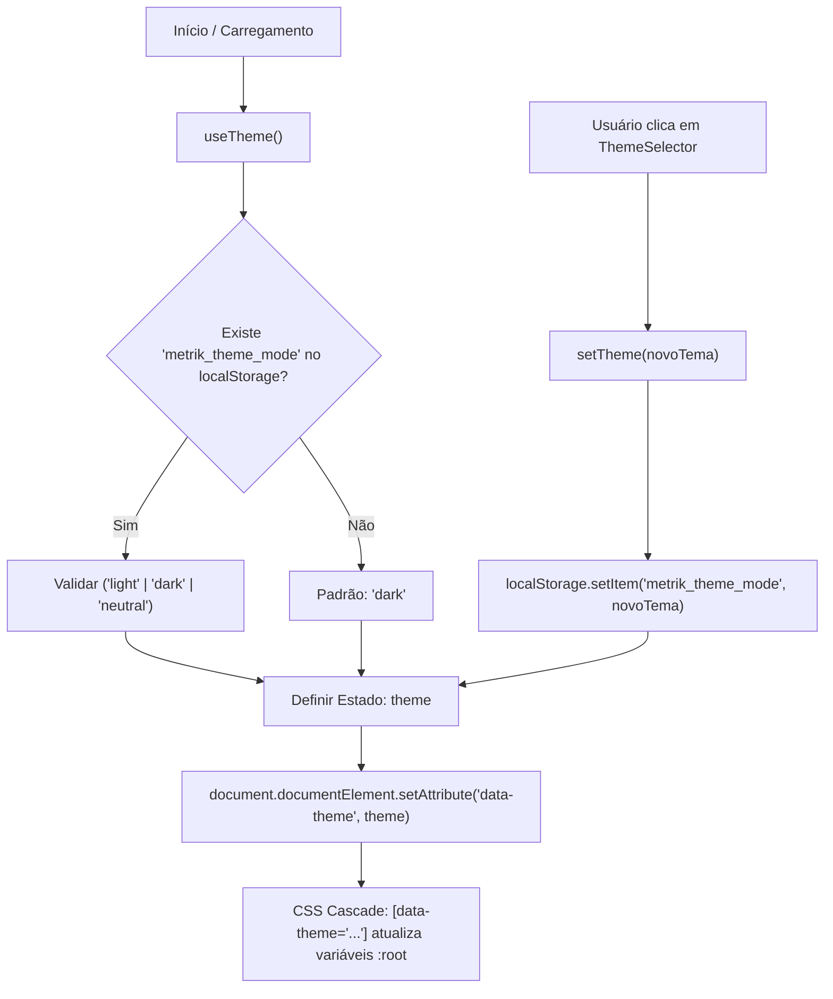

# Data Model & Architecture: Feature 022 - Configuração de Temas (Theme Configuration)

**Feature**: `022-theme-configuration` | **Date**: 2026-09-12

---

## 1. Estruturas de Entidades e Tipos de Dados

### 1.1 `ThemeMode` (Tipo Literal de Modo de Tema)
```typescript
export type ThemeMode = 'light' | 'dark' | 'neutral';
```

### 1.2 `ThemeOption` (Metadados de Apresentação das Opções de Tema)
```typescript
export interface ThemeOption {
  id: ThemeMode;
  label: string;       // "Claro", "Escuro", "Neutro"
  icon: string;        // "☀️", "🌙", "⚖️" (ou componente de ícone SVG)
  ariaLabel: string;   // "Ativar tema Claro", etc.
}
```

### 1.3 `UseThemeReturn` (Contrato do Hook de Tema)
```typescript
export interface UseThemeReturn {
  theme: ThemeMode;
  setTheme: (theme: ThemeMode) => void;
}
```

---

## 2. Mapa de Tokens de Design por Modo de Tema

| Token CSS | Escuro (`dark`) | Claro (`light`) | Neutro (`neutral`) |
|---|---|---|---|
| `--bg-primary` | `#0b0f19` | `#f8fafc` | `#1e222b` |
| `--bg-secondary` | `#0f172a` | `#ffffff` | `#282e3d` |
| `--bg-board` | `#0b0f19` | `#f1f5f9` | `#1e222b` |
| `--bg-column` | `#121a2d` | `#e2e8f0` | `#262c3a` |
| `--bg-column-header` | `#152037` | `#cbd5e1` | `#2e3546` |
| `--bg-card` | `#1e293b` | `#ffffff` | `#2f3647` |
| `--bg-card-hover` | `#24344d` | `#f8fafc` | `#373f52` |
| `--color-surface-elevated` | `#1e293b` | `#ffffff` | `#2f3647` |
| `--card-bg` | `#1e293b` | `#ffffff` | `#2f3647` |
| `--border-subtle` | `rgba(255, 255, 255, 0.08)` | `rgba(0, 0, 0, 0.08)` | `rgba(255, 255, 255, 0.09)` |
| `--border-color` | `rgba(255, 255, 255, 0.08)` | `rgba(0, 0, 0, 0.08)` | `rgba(255, 255, 255, 0.09)` |
| `--border-focus` | `rgba(56, 189, 248, 0.5)` | `rgba(2, 132, 199, 0.5)` | `rgba(56, 189, 248, 0.5)` |
| `--text-primary` | `#f8fafc` | `#0f172a` | `#f1f5f9` |
| `--text-secondary` | `#94a3b8` | `#475569` | `#94a3b8` |
| `--text-muted` | `#64748b` | `#64748b` | `#64748b` |
| `--color-text` | `#f8fafc` | `#0f172a` | `#f1f5f9` |
| `--color-text-secondary` | `#94a3b8` | `#475569` | `#94a3b8` |
| `--shadow-sm` | `0 1px 3px rgba(0, 0, 0, 0.3)` | `0 1px 3px rgba(0, 0, 0, 0.08)` | `0 1px 3px rgba(0, 0, 0, 0.25)` |
| `--shadow-md` | `0 3px 8px rgba(0, 0, 0, 0.4)` | `0 3px 8px rgba(0, 0, 0, 0.12)` | `0 3px 8px rgba(0, 0, 0, 0.35)` |
| `--shadow-lg` | `0 8px 20px rgba(0, 0, 0, 0.5)` | `0 8px 20px rgba(0, 0, 0, 0.15)` | `0 8px 20px rgba(0, 0, 0, 0.45)` |

---

## 3. Diagrama de Fluxo e Aplicação de Tema


