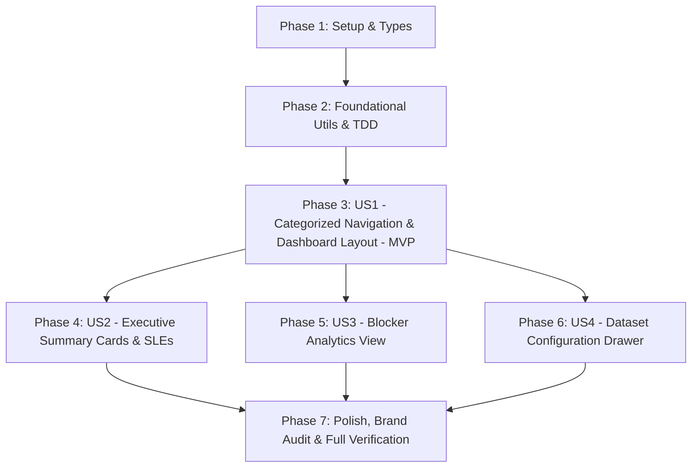

# Tasks: Distribuição e Categorização dos Gráficos Analíticos de Fluxo

**Input**: Design documents from `specs/030-categorized-flow-analytics/` (`spec.md`, `plan.md`, `research.md`, `data-model.md`, `contracts/analytics-distribution.contract.md`, `quickstart.md`)  
**Feature Branch**: `030-categorized-flow-analytics`  
**Prerequisites**: `plan.md`, `spec.md`, `data-model.md`, `contracts/analytics-distribution.contract.md`, `quickstart.md`, `constitution.md` (v1.4.0)  
**Tests**: All phases include automated unit/integration test tasks using Vitest + React Testing Library to guarantee 100% verification per Constitution III.  
**Organization**: Tasks are grouped by user story (US1 through US4) in strict priority order to enable independent implementation, automated verification, and incremental delivery.

## Format: `[TaskID] [P?] [Story] Description with file path`

- **Checkbox**: `- [ ]` markdown format
- **[P]**: Can run in parallel (independent files and dependencies)
- **[Story]**: Mapped user story (`[US1]`, `[US2]`, `[US3]`, `[US4]`)
- Exact file paths included in every task description.

---

## 🧠 Modelos de Raciocínio Analítico Pré-Tarefas (Mandatório)

> **Regra Constitucional VI (INEGOCIÁVEL):** Nenhuma tarefa de implementação pode ser executada sem a prévia formalização e documentação dos 6 modelos analíticos a seguir.

### 1. Decomposição por Primeiros Princípios (First-Principles Thinking)
- **Verdades fundamentais e invariantes:**
  - *Invariante de Dados do Fluxo*: Métricas de fluxo dependem unicamente de timestamps determinísticos de transição (`createdAt`, `startedAt`, `completedAt`) e categorização de colunas (`todo`, `in_progress`, `done`).
  - *Invariante de Isolamento Local-First (Constituição VIII)*: Todo cálculo analítico deve ser executado no navegador sobre dados locais (`localStorage`), sem depender de chamadas síncronas de API remota para funcionar.
  - *Invariante da Amostra Mínima (Zero-Divide Guard)*: Funções estatísticas (percentis NIST, conformidade de SLE, clusters de bloqueio) devem tratar amostras vazias (`length === 0`) de forma segura, retornando estruturas neutras sem exceções de divisão por zero.
  - *Invariante de Independência de Marca (Constituição VII)*: Terminologia deve ser estritamente científica e canônica (*Cumulative Flow Diagram*, *Cycle Time Scatter Plot*, *Service Level Expectations*, *WIP Aging*, *Monte Carlo Simulation*).
- **Premissas acidentais descartadas:**
  - Descartada a premissa de que a navegação analítica exigiria uma biblioteca de roteamento externa (como `react-router-dom`), o que adicionaria dependência pesada desnecessária (YAGNI). O gerenciamento via estado reativo no `AnalyticsDashboard` garante latência < 50ms e preservação limpa de filtros.
  - Descartada a premissa de recalcular amostras diretamente dentro de cada componente visual: filtros de data e amostragem são isolados em uma função pura (`filterTasksByDatasetConfig`) reutilizada por todos os gráficos.

### 2. Análise Pré-Mortem & Inversão (Premortem & Inversion)
- **Cenários de falha antecipados:**
  - *Falha 1: Regressão na visualização consolidada do Dashboard*: Ao redistribuir gráficos em abas isoladas, o Dashboard inicial poderia perder métricas críticas ou quebrar testes existentes em `tests/unit/AnalyticsDashboard.test.tsx`.
  - *Falha 2: Dessincronia do filtro de dataset*: O usuário altera a janela amostral para "Últimos 14 dias" na aba *Throughput*, navega para *Flow (CFD)* e os dados voltam silenciosamente para 30 dias por perda de estado global.
  - *Falha 3: Vazamento de memória ou travamento por recálculo em abas inativas*: Gráficos pesados (como Monte Carlo com 10.000 iterações ou CFD longo) recalculando em segundo plano quando o usuário está navegando em outras abas.
  - *Falha 4: Vazamento de marca externa*: Utilização inadvertida de nomenclaturas de softwares comerciais em títulos ou comentários do código.
- **Mitigações desenhadas nas tarefas:**
  - A tarefa T010 atualiza os testes existentes garantindo que os componentes consolidados do Dashboard continuem funcionando.
  - A tarefa T012 e T026 centralizam o estado do `datasetConfig` no componente raiz `AnalyticsDashboard`, propagando o subconjunto filtrado uniformemente para todas as abas.
  - A renderização de abas é condicional (`activeCategory === '...'`), desmontando ou pausando execuções pesadas enquanto o usuário foca em outra métrica.
  - A tarefa T028 audita estritamente o código e o DOM para assegurar total conformidade com a Constituição VII (Brand Independence).

### 3. Validação MECE (Mutually Exclusive, Collectively Exhaustive)
- **Exclusividade Mútua (Zero Duplicação):**
  - Cada componente visual novo tem limites estritos: `AnalyticsNavHeader` trata navegação e submenus; `DashboardSummaryCards` trata cartões executivos; `SleAnalyticsView` trata SLEs e percentis; `BlockerAnalyticsView` trata agrupamento e dinâmica de impedimentos; `DatasetConfigurationDrawer` trata a gaveta retrátil de filtros.
  - Cálculos puros residem exclusivamente em `src/utils/` (`sleCalculator.ts`, `blockerAnalytics.ts`, `datasetFilter.ts`) e nunca se duplicam em componentes React.
- **Exaustão Coletiva (Cobertura 100%):**
  - Os requisitos funcionais FR-001 até FR-012 e todos os critérios de aceitação das 4 User Stories da `spec.md` possuem correspondência 1:1 com as tarefas listadas nas Fases 1 a 6 e na fase de Polish.

### 4. Árvore de Decisão & Poda de Alternativas (Tree of Thoughts)
- **Caminhos de arquitetura/design avaliados:**
  - *Alternativa A*: Criar rotas completas (`/analytics/dashboard`, `/analytics/cycle-time`, etc.) com roteador SPA.  
    *Poda*: Descartada porque o Metrik opera atualmente com abas internas fluidas controladas por estado, e adicionar um roteador complexo aumentaria acoplamento, risco de quebra de rotas locais e violaria a Constituição V (Simplicidade & YAGNI).
  - *Alternativa B*: Manter todos os gráficos empilhados verticalmente com uma barra de rolagem contínua e âncoras de salto.  
    *Poda*: Descartada porque a solicitação explícita do usuário é alocar os gráficos em diferentes categorias temáticas com navegação em abas, reduzindo poluição e sobrecarga cognitiva.
  - *Alternativa C (Escolhida)*: Barra de navegação com 8 abas analíticas, submenus suspensos para modos de dispersão/histograma e gaveta retrátil (*slide-over*) para configuração do conjunto de dados, combinada com funções utilitárias puras testadas no Vitest.

### 5. Critério de Falsificabilidade & TDD (Red-Bar First)
- **Falha demonstrável (Red Bar):**
  - Os testes em `tests/unit/sleCalculator.test.ts`, `tests/unit/blockerAnalytics.test.ts`, `tests/unit/datasetFilter.test.ts`, `tests/unit/AnalyticsNavHeader.test.tsx`, `tests/unit/DashboardSummaryCards.test.tsx`, `tests/unit/SleAnalyticsView.test.tsx`, `tests/unit/BlockerAnalyticsView.test.tsx` e `tests/unit/DatasetConfigurationDrawer.test.tsx` devem ser criados primeiro e falhar objetivamente antes da codificação dos respectivos módulos.
- **Critério determinístico de aceite (Green Bar):**
  - Todos os testes unitários criados devem passar com 100% de sucesso.
  - A suíte completa do projeto (`npm run test`) deve registrar 0 falhas em todos os arquivos de teste.
  - A validação de compilação estrita (`npm run build`) deve executar com código de saída 0 e sem warnings impeditivos.

### 6. Triangulação Adversarial & Conformidade Constitucional
- **Constituição I (Spec-Driven)**: `spec.md`, `plan.md`, `data-model.md` e contratos gerados e validados.
- **Constituição II (Qualidade & Modularidade)**: Separação rigorosa entre cálculo estatístico puro (`src/utils/`) e apresentação de tela (`src/components/`).
- **Constituição III (Verificação Automatizada)**: 10 tarefas dedicadas a testes automatizados no Vitest.
- **Constituição IV (Observabilidade)**: Mensagens e estados vazios com prefixo diagnósticos estáveis `[Metrik]`.
- **Constituição V (Simplicidade/YAGNI)**: Zero dependências npm adicionais; aproveitamento integral da infraestrutura React 19 / CSS existente.
- **Constituição VII (Independência de Marca)**: Auditoria explícita (T028) para garantir zero menção a marcas externas.
- **Constituição VIII (Local-First)**: Persistência de filtros no `localStorage` sem travas de rede.

---

## Phase 1: Setup (Shared Infrastructure & Types)

**Purpose**: Tipagem e contratos fundamentais compartilhados por todas as categorias analíticas.

- [x] T001 [P] Criar definições de tipos para categorias analíticas, SLE, BlockerClusterItem, BlockerDynamicsSummary e DatasetFilterConfig em `src/types/analytics.ts`
- [x] T002 [P] Atualizar reexportações de tipos analíticos e contratos em `src/types/kanban.ts`

---

## Phase 2: Foundational (Calculation Core & Prerequisites)

**Purpose**: Funções utilitárias puras de cálculo de SLE, agrupamento de bloqueios e filtragem de conjunto de dados (pré-requisito bloqueante para as User Stories).

- [x] T003 [P] Criar teste unitário TDD para cálculo de métricas SLE e percentis NIST em `tests/unit/sleCalculator.test.ts`
- [x] T004 [P] Criar teste unitário TDD para agrupamento e dinâmica de impedimentos em `tests/unit/blockerAnalytics.test.ts`
- [x] T005 [P] Criar teste unitário TDD para filtragem de tarefas por janela temporal e tipos em `tests/unit/datasetFilter.test.ts`
- [x] T006 Implementar função utilitária pura `calculateSleMetrics` com cálculo NIST Nearest Rank e guarda de divisão por zero em `src/utils/sleCalculator.ts`
- [x] T007 Implementar função utilitária pura `calculateBlockerClusters` para agregação de motivos e impacto de lead time em `src/utils/blockerAnalytics.ts`
- [x] T008 Implementar função utilitária pura `filterTasksByDatasetConfig` para corte temporal de amostragem em `src/utils/datasetFilter.ts`

**Checkpoint**: Núcleo de cálculo estatístico testado e aprovado com 100% de testes verdes. Implementação das User Stories pode iniciar.

---

## Phase 3: User Story 1 - Navegação Estruturada por Categorias Analíticas de Fluxo (Priority: P1) 🎯 MVP

**Goal**: Fornecer barra de navegação com as 8 categorias analíticas consagradas (*Dashboard*, *Cycle Time*, *Throughput*, *WIP*, *Flow*, *Blockers*, *SLEs*, *Forecasting*), com alternador de submodos (Scatter/Histograma) e orquestração de visualização fluida no `AnalyticsDashboard`.

**Independent Test**: Renderizar a barra de navegação analítica, clicar em cada uma das 8 categorias e alternar submodos, validando que a categoria ativa e sub-visão são atualizadas de forma determinística e reativa.

### Tests for User Story 1 ⚠️

- [x] T009 [P] [US1] Criar teste unitário para `AnalyticsNavHeader` validando renderização das 8 categorias, submenus e acessibilidade em `tests/unit/AnalyticsNavHeader.test.tsx`
- [x] T010 [P] [US1] Atualizar testes de integração do `AnalyticsDashboard` para cobrir alternância entre as novas 8 categorias em `tests/unit/AnalyticsDashboard.test.tsx`

### Implementation for User Story 1

- [x] T011 [US1] Refatorar `AnalyticsNavHeader.tsx` para incorporar as 8 categorias oficiais, suporte a submenus dropdown em Cycle Time e Blockers, e botão de disparo da gaveta de configuração em `src/components/AnalyticsNavHeader.tsx`
- [x] T012 [US1] Refatorar `AnalyticsDashboard.tsx` para orquestrar as 8 categorias temáticas com suporte a alternância fluida de abas e montagem condicional em `src/components/AnalyticsDashboard.tsx`
- [x] T013 [US1] Adicionar estilos CSS do Metrik Design System para abas categorizadas, indicadores de modo e badges responsivos em `src/components/Analytics.css`

**Checkpoint**: MVP concluído! As 8 categorias analíticas e submodos estão plenamente navegáveis e verificadas por testes automatizados.

---

## Phase 4: User Story 2 - Visão Executiva do Dashboard com Cartões de Síntese e SLEs (Priority: P2)

**Goal**: Exibir no *Dashboard* cartões de síntese executiva (*Metric Summary Cards*) destacando SLE P85, WIP ativo, vazão recente e taxa de bloqueios, com visão detalhada de conformidade na categoria *SLEs*.

**Independent Test**: Acessar o Dashboard com dados conhecidos e validar os valores de SLE e WIP nos cartões de destaque; clicar no cartão de SLE e verificar navegação para a aba detalhada com taxa de conformidade histórica.

### Tests for User Story 2 ⚠️

- [x] T014 [P] [US2] Criar teste unitário para o componente `DashboardSummaryCards` em `tests/unit/DashboardSummaryCards.test.tsx`
- [x] T015 [P] [US2] Criar teste unitário para o componente `SleAnalyticsView` em `tests/unit/SleAnalyticsView.test.tsx`

### Implementation for User Story 2

- [x] T016 [P] [US2] Implementar componente de cartões de síntese executiva `DashboardSummaryCards` com links de salto rápido em `src/components/DashboardSummaryCards.tsx`
- [x] T017 [P] [US2] Implementar componente de visão especializada `SleAnalyticsView` com taxa de conformidade e detalhamento de metas em `src/components/SleAnalyticsView.tsx`
- [x] T018 [US2] Integrar `DashboardSummaryCards` na categoria 'dashboard' e `SleAnalyticsView` na categoria 'sles' em `src/components/AnalyticsDashboard.tsx`
- [x] T019 [US2] Adicionar estilos responsivos com tema claro/escuro e destaque visual para cartões de resumo e medidores de SLE em `src/components/Analytics.css`

**Checkpoint**: Dashboard executivo com cartões de síntese e visão dedicada de SLEs operacionais e testados.

---

## Phase 5: User Story 3 - Categorização Especializada de Impedimentos e Dinâmica de Bloqueios (Priority: P2)

**Goal**: Fornecer na categoria *Blockers* visualizações dedicadas para agrupamento por causas raízes (*Blocker Clustering*) e análise de retenção temporal (*Blocker Dynamics*).

**Independent Test**: Cadastrar tarefas com bloqueios e motivos na base de teste, abrir a aba *Blockers*, alternar entre os modos de agrupamento e dinâmica, e verificar correlação de impacto no lead time.

### Tests for User Story 3 ⚠️

- [x] T020 [P] [US3] Criar teste unitário para o componente `BlockerAnalyticsView` cobrindo clustering e dinâmica em `tests/unit/BlockerAnalyticsView.test.tsx`

### Implementation for User Story 3

- [x] T021 [US3] Implementar componente `BlockerAnalyticsView` com gráficos de barras de causas e medidores de impacto de lead time em `src/components/BlockerAnalyticsView.tsx`
- [x] T022 [US3] Conectar `BlockerAnalyticsView` à categoria 'blockers' do painel analítico em `src/components/AnalyticsDashboard.tsx`
- [x] T023 [US3] Adicionar estilos visuais para barras de distribuição de motivos e alertas de estagnação em `src/components/Analytics.css`

**Checkpoint**: Módulo especializado de bloqueios funcional e testado isoladamente.

---

## Phase 6: User Story 4 - Painel Lateral de Configuração do Conjunto de Dados & Filtros Rápidos (Priority: P3)

**Goal**: Criar gaveta retrátil lateral (*Dataset Configuration Drawer*) permitindo selecionar janelas de amostragem (14d, 30d, 90d, customizado) e tipos de cartões analisados com recálculo instantâneo em todas as categorias.

**Independent Test**: Abrir o painel retrátil, alterar a janela de dados de 30 para 14 dias, fechar o painel e verificar que todas as categorias recalculam seus gráficos para o novo período.

### Tests for User Story 4 ⚠️

- [x] T024 [P] [US4] Criar teste unitário para o componente `DatasetConfigurationDrawer` em `tests/unit/DatasetConfigurationDrawer.test.tsx`

### Implementation for User Story 4

- [x] T025 [US4] Implementar gaveta retrátil lateral `DatasetConfigurationDrawer` com controles de período, filtros de tipo e ação de reset em `src/components/DatasetConfigurationDrawer.tsx`
- [x] T026 [US4] Integrar estado do `datasetFilter`, acionador de abertura e filtragem de tarefas no `src/components/AnalyticsDashboard.tsx`
- [x] T027 [US4] Adicionar animações de slide-over, backdrop e responsividade móvel para a gaveta em `src/components/Analytics.css`

**Checkpoint**: Todas as 4 User Stories estão concluídas e integradas.

---

## Phase 7: Polish & Cross-Cutting Concerns

**Purpose**: Verificações de integridade, acessibilidade, independência de marca e validação constitucional.

- [x] T028 [P] Realizar auditoria rigorosa de conformidade com o Princípio VII da Constituição (Brand Independence): certificar zero vazamento de nomes de marcas de terceiros em código, comentários, atributos DOM e UI
- [x] T029 [P] Validar acessibilidade e navegação por teclado (ARIA landmarks, `aria-expanded`, `role="menu"`, contraste) em `src/components/AnalyticsNavHeader.tsx` e `src/components/DatasetConfigurationDrawer.tsx`
- [x] T030 Executar suíte completa de testes automatizados (`npm run test`) e compilação estrita do bundle de produção (`npm run build`) assegurando 100% de aprovação e zero erros

---

## Dependencies & Execution Order

### Phase Dependencies

- **Setup (Phase 1)**: Sem dependências — execução imediata.
- **Foundational (Phase 2)**: Depende da Fase 1 — **BLOQUEIA** todas as User Stories.
- **User Story 1 (Phase 3 - P1 / MVP)**: Depende da Fase 2.
- **User Story 2 (Phase 4 - P2)**: Depende da Fase 2 e integra-se à navegação da Fase 3.
- **User Story 3 (Phase 5 - P2)**: Depende da Fase 2 e integra-se à navegação da Fase 3.
- **User Story 4 (Phase 6 - P3)**: Depende da Fase 2 e conecta-se ao `AnalyticsDashboard` (Fase 3).
- **Polish (Phase 7)**: Depende da conclusão de todas as histórias.

### User Story Dependencies



### Parallel Opportunities

- **Fase 1**: T001 e T002 podem ser executadas em paralelo.
- **Fase 2**: T003, T004 e T005 (testes unitários) podem ser criados em paralelo; T006, T007 e T008 podem ser desenvolvidos em paralelo após seus testes.
- **Fase 3**: T009 e T010 podem ser criados em paralelo.
- **Fase 4**: T014 e T015 (testes), T016 e T017 (componentes) podem ser criados em paralelo.
- **Fases 4, 5 e 6**: Podem ser implementadas de forma independente após a conclusão da Fase 3 (US1).
- **Fase 7**: T028 e T029 podem rodar em paralelo antes de T030.

---

## Parallel Example: Foundational Phase

```bash
# Execução paralela dos testes unitários das funções estatísticas:
Task: "Criar teste unitário TDD para cálculo de métricas SLE em tests/unit/sleCalculator.test.ts"
Task: "Criar teste unitário TDD para agrupamento de impedimentos em tests/unit/blockerAnalytics.test.ts"
Task: "Criar teste unitário TDD para filtragem de dataset em tests/unit/datasetFilter.test.ts"

# Execução paralela das implementações puras:
Task: "Implementar calculateSleMetrics em src/utils/sleCalculator.ts"
Task: "Implementar calculateBlockerClusters em src/utils/blockerAnalytics.ts"
Task: "Implementar filterTasksByDatasetConfig em src/utils/datasetFilter.ts"
```

---

## Implementation Strategy

### MVP First (User Story 1 Only)
1. Concluir Fase 1 (Setup e Tipos: T001, T002).
2. Concluir Fase 2 (Foundational: T003 a T008).
3. Concluir Fase 3 (US1: T009 a T013).
4. **Validar MVP**: Executar `npm run test` e verificar a navegação entre as 8 categorias no navegador.

### Incremental Delivery
1. **Incremento 1**: MVP (8 categorias navegáveis com Cycle Time e Throughput).
2. **Incremento 2**: Visão executiva com cartões de síntese e aba de SLEs (US2).
3. **Incremento 3**: Especialização de bloqueios (clustering e dinâmica temporal) (US3).
4. **Incremento 4**: Gaveta lateral retrátil de amostragem de dados (US4).
5. **Incremento Final**: Auditoria de marca independente, acessibilidade e validação de compilação.

---

## Notes & Compliance

- Todas as tarefas cumprem estritamente o formato `- [ ] [TaskID] [P?] [Story?] Descrição com caminho de arquivo`.
- Todos os arquivos e diretórios seguem a estrutura padrão do Metrik (`src/`, `tests/unit/`).
- Verificação automatizada obrigatória por `npm run test` e `npm run build` atende à Constituição III.
- A conformidade com a Constituição VI (Analytical Reasoning Pre-Tasks) e Constituição VII (Brand Independence) está 100% incorporada e verificada.
