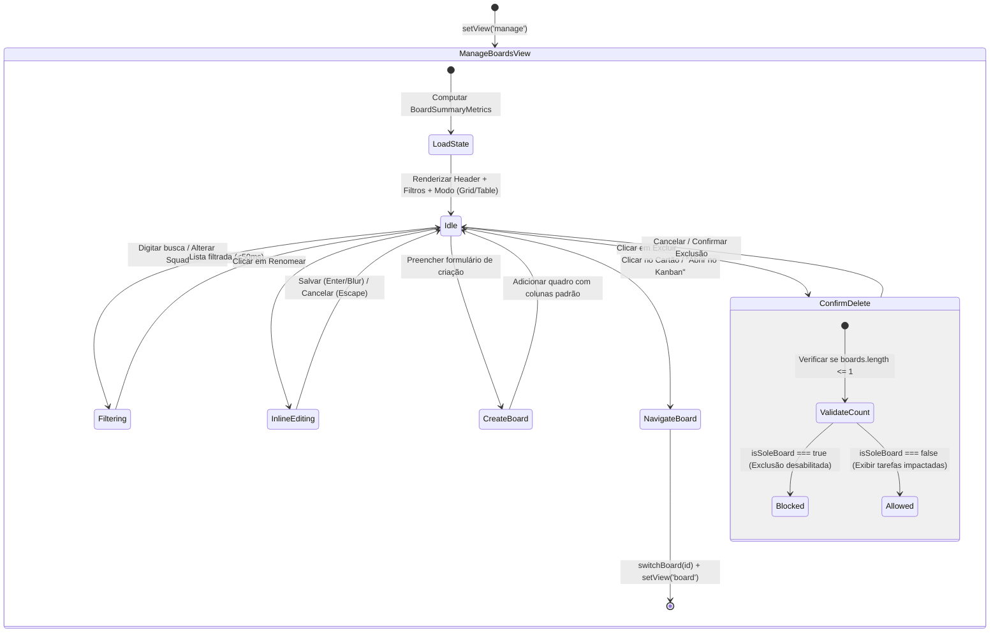

# Data Model & State Architecture: Gerenciamento Premium de Quadros (Feature 031)

**Feature**: `031-premium-board-management`  
**Status**: Complete  
**Date**: 2026-09-17  

---

## 1. Entities & Types

### 1.1 `BoardSummaryMetrics`
Representa a telemetria calculada pura de um quadro para apresentação na grade e na tabela de gerenciamento.

```typescript
export interface BoardSummaryMetrics {
  /** Identificador único do quadro */
  boardId: string;
  /** Quantidade total de colunas configuradas no quadro */
  columnsCount: number;
  /** Quantidade total de tarefas distribuídas em todas as colunas */
  totalTasksCount: number;
  /** Quantidade de tarefas atualmente em colunas de categoria 'in_progress' (Trabalho em Andamento / WIP) */
  wipTasksCount: number;
  /** Quantidade de tarefas em colunas de categoria 'done' (Concluídas) */
  doneTasksCount: number;
  /** Se o quadro é o quadro atualmente ativo na sessão de trabalho */
  isActive: boolean;
}
```

### 1.2 `BoardManagementFilterState`
Controla os filtros interativos e modo de exibição da tela de gerenciamento.

```typescript
export type BoardViewMode = 'grid' | 'table';

export interface BoardManagementFilterState {
  /** Termo de busca textual filtrado em tempo real por nome */
  searchQuery: string;
  /** Filtro por Squad/Time específico ou 'all' para todas as squads autorizadas */
  selectedTeamId: string | 'all';
  /** Modo ativo de apresentação da visualização */
  viewMode: BoardViewMode;
}
```

### 1.3 `DeleteBoardModalState`
Controla a abertura, contexto e segurança da exclusão de um quadro.

```typescript
export interface DeleteBoardModalState {
  /** Se a caixa de diálogo de confirmação está aberta */
  isOpen: boolean;
  /** ID do quadro alvo de exclusão */
  targetBoardId: string | null;
  /** Nome legível do quadro para exibição em destaque */
  targetBoardName: string;
  /** Total de tarefas que serão permanentemente removidas */
  tasksCount: number;
  /** Indicador se o quadro é o único restante no sistema (bloqueando a exclusão) */
  isSoleBoard: boolean;
}
```

---

## 2. Component State Lifecycle



---

## 3. Storage & Local-First Invariants

1. **Invariante de Isolamento Local-First (Constituição VIII)**:
   - A lista de quadros e métricas é derivada e persistida no `localStorage` sob a chave canônica do Metrik.
   - A exclusão de um quadro purga com integridade suas tarefas associadas e referências em `favoriteBoardIds`.
2. **Invariante de Preservação Mínima de Quadros**:
   - A aplicação nunca pode ter 0 quadros. Se o usuário possuir apenas 1 quadro, a ação de exclusão é estruturalmente impedida com alerta informativo.
3. **Invariante de Restrição de Convidado (*Guest Role*)**:
   - Se o usuário ativo possuir papel `guest` no squad do quadro, os botões de criação, renomeação e exclusão são renderizados desabilitados ou ocultos.
