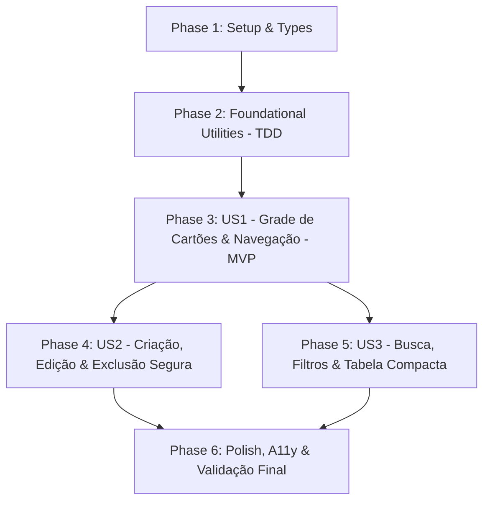

# Tasks: Gerenciamento Premium de Quadros e Espaços (Aba Gerenciar)

**Input**: Design documents from `specs/031-premium-board-management/` (`spec.md`, `plan.md`, `research.md`, `data-model.md`, `contracts/board-management.contract.md`, `quickstart.md`, `checklists/board-management.md`)  
**Feature Branch**: `031-premium-board-management`  
**Prerequisites**: `plan.md`, `spec.md`, `data-model.md`, `contracts/board-management.contract.md`, `quickstart.md`, `constitution.md` (v1.5.0)  
**Tests**: Todas as fases contêm tarefas de testes automatizados com Vitest e React Testing Library para garantir conformidade estrita com a Constituição III.  
**Organization**: As tarefas são agrupadas por histórias de usuário (US1 a US3) em ordem estrita de prioridade para entrega incremental.

## Format: `[TaskID] [P?] [Story] Description with file path`

- **Checkbox**: Formato `- [ ]` do markdown
- **[P]**: Tarefa executável em paralelo (arquivos independentes e sem bloqueios)
- **[Story]**: História de usuário mapeada (`[US1]`, `[US2]`, `[US3]`)
- Caminhos absolutos/relativos exatos incluídos em cada descrição de tarefa.

---

## 🧠 Modelos de Raciocínio Analítico Pré-Tarefas (Mandatório)

> **Regra Constitucional VI (INEGOCIÁVEL):** Nenhuma tarefa de implementação pode ser executada sem a prévia formalização e documentação dos 6 modelos analíticos a seguir.

### 1. Decomposição por Primeiros Princípios (First-Principles Thinking)
- **Verdades fundamentais e invariantes:**
  - *Invariante de Dados do Quadro*: Todo quadro no Metrik é uma entidade determinística com identificador (`id`), nome (`name`), colunas (`columns`) e tarefas mapeadas por coluna (`tasks`).
  - *Invariante de Preservação Mínima*: A aplicação não pode existir sem ao menos 1 quadro ativo. A tentativa de deletar o único quadro remanescente deve ser estruturalmente barrada para evitar corrupção de estado ou visualizações vazias irreversíveis.
  - *Invariante de Isolamento Local-First (Constituição VIII)*: Toda a navegação, listagem, telemetria e edição de quadros opera diretamente sobre a memória local (`localStorage`), funcionando 100% offline sem depender de requisições de rede.
  - *Invariante de Independência de Marca (Constituição VII)*: Terminologia estritamente canônica (*Kanban Board*, *WIP*, *Cycle Time*, *Throughput*, *Squad Allocation*, *Metrik Design System*).
- **Premissas acidentais descartadas:**
  - Descartada a premissa de que o gerenciamento de quadros deve ser uma janela modal restrita a 540px: um canvas de tela cheia acessível via aba de navegação aproveita o espaço horizontal, possibilita alternância entre Grade e Tabela e enriquece a experiência visual.
  - Descartada a premissa de usar alertas nativos do navegador (`window.confirm` e `window.alert`): caixas nativas travam a thread principal, são inestéticas e incompatíveis com o padrão premium do produto.

### 2. Análise Pré-Mortem & Inversão (Premortem & Inversion)
- **Cenários de falha antecipados:**
  - *Falha 1: Perda acidental de tarefas ao excluir quadro*: O usuário clica em excluir sem perceber que o quadro continha dezenas de tarefas em andamento.
  - *Falha 2: Dessincronia entre a nova aba e o seletor de quadros*: O usuário clica em "Gerenciar" no seletor de quadros e a interface não alterna para a nova aba ou causa colisão de rotas.
  - *Falha 3: Quebra de layout em resoluções móveis*: A grade de cartões com telemetria sobrepõe elementos ou estoura a largura horizontal em smartphones e tablets (< 768px).
  - *Falha 4: Violação de permissão de Convidado*: Usuários no papel `guest` conseguem renomear ou deletar quadros da squad.
- **Mitigações desenhadas nas tarefas:**
  - A tarefa T011/T012 implementa o `DeleteBoardModal` exibindo a contagem exata de tarefas que serão perdidas e exigindo confirmação explícita.
  - A tarefa T010 sincroniza o seletor `BoardSwitcher` com o estado `view = 'manage'` no `App.tsx`.
  - A tarefa T009/T020 utiliza CSS Grid com `minmax()` e media queries que colapsam a grade para coluna única em telas compactas.
  - A tarefa T014/T015 impõe a verificação do papel do usuário ativo ocultando ações destrutivas para convidados.

### 3. Validação MECE (Mutually Exclusive, Collectively Exhaustive)
- **Exclusividade Mútua (Zero Duplicação):**
  - Cada componente tem limites estritos: `boardMetrics.ts` calcula telemetria pura; `BoardCardGrid.tsx` renderiza apenas cartões visuais; `BoardTableView.tsx` renderiza apenas a tabela densa; `DeleteBoardModal.tsx` gerencia apenas a confirmação de exclusão; `ManageBoardsView.tsx` orquestra filtros e layout.
  - As tarefas de testes unitários antecedem estritamente a codificação dos seus respectivos componentes.
- **Exaustão Coletiva (Cobertura 100%):**
  - Todos os requisitos funcionais (FR-001 até FR-013), todos os critérios de aceitação das User Stories 1, 2 e 3 da `spec.md`, e os 15 itens do checklist de domínio (`board-management.md`) possuem correspondência 1:1 nas fases de implementação.

### 4. Árvore de Decisão & Poda de Alternativas (Tree of Thoughts)
- **Caminhos de arquitetura avaliados:**
  - *Alternativa A*: Aumentar a largura da janela modal legada para 800px sem criar uma aba nova.  
    *Poda*: Descartada porque continua sendo uma sobreposição temporária, sem espaço adequado para alternância entre Tabela e Grade e sem sensação de tela de gerenciamento de primeira classe.
  - *Alternativa B*: Mover o gerenciamento de quadros para dentro do módulo de Configurações (`SettingsView`).  
    *Poda*: Descartada porque alternar e gerenciar quadros é uma atividade operacional frequente de fluxo, e não uma configuração de preferências do sistema.
  - *Alternativa C (Escolhida)*: Elevar "Gerenciar" a uma aba de primeira classe no cabeçalho superior (`Espaços | Quadro | Analytics | Gerenciar | Configurações`), mantendo o seletor sincronizado, com alternador dual Grade/Tabela e diálogo modal seguro.

### 5. Critério de Falsificabilidade & TDD (Red-Bar First)
- **Falha demonstrável (Red Bar):**
  - Os testes em `tests/unit/boardMetrics.test.ts`, `tests/unit/BoardCardGrid.test.tsx`, `tests/unit/ManageBoardsView.test.tsx`, `tests/unit/DeleteBoardModal.test.tsx` e `tests/unit/BoardTableView.test.tsx` devem ser executados primeiro e falhar antes da criação dos arquivos de implementação.
- **Critério determinístico de aceite (Green Bar):**
  - Todos os novos testes unitários e de integração passam com 100% de sucesso.
  - A suíte completa da aplicação (`npm run test`) mantém 0 falhas em todos os arquivos de teste.
  - O bundle de produção (`npm run build`) compila com código 0 e sem warnings impeditivos.

### 6. Triangulação Adversarial & Conformidade Constitucional
- **Constituição I (Spec-Driven)**: Especificação, checklist de domínio, plano e contratos validados.
- **Constituição II (Qualidade & Modularidade)**: Separação estrita entre utilitários puros em `src/utils/` e visualização em `src/components/ManageBoards/`.
- **Constituição III (Verificação Automatizada)**: 5 tarefas de testes automatizados dedicadas no Vitest.
- **Constituição IV (Observabilidade)**: Tratamento explícito de estado vazio e avisos informativos com prefixo `[Metrik]`.
- **Constituição V (Simplicidade & YAGNI)**: Zero bibliotecas npm externas adicionadas.
- **Constituição VII (Independência de Marca)**: Auditoria explícita (T021) para garantir zero menção a marcas proprietárias de terceiros.
- **Constituição VIII (Local-First & TBAC)**: Preservação da soberania dos dados no `localStorage` e isolamento de squads.

---

## Phase 1: Setup (Shared Infrastructure & Types)

**Purpose**: Tipagem TypeScript, modelagem de dados e contratos compartilhados pela nova visualização.

- [ ] T001 [P] Criar definições de tipos para telemetria de quadros, filtros e estados de modal em `src/types/boardManagement.ts` ([#123](https://github.com/rogerteg/Metrik/issues/123))
- [ ] T002 [P] Atualizar reexportações de tipos em `src/types/kanban.ts` para incluir os novos modelos de gerenciamento ([#124](https://github.com/rogerteg/Metrik/issues/124))

---

## Phase 2: Foundational (Calculation Core & Prerequisites)

**Purpose**: Utilitário puro para cálculo determinístico de métricas de fluxo dos quadros (pré-requisito bloqueante para todas as visualizações).

- [ ] T003 [P] Criar teste unitário TDD para função de telemetria e métricas de quadros em `tests/unit/boardMetrics.test.ts` ([#125](https://github.com/rogerteg/Metrik/issues/125))
- [ ] T004 Implementar função utilitária pura `computeBoardSummaryMetrics` para cálculo de contagem de tarefas, colunas, WIP e marcação de quadro ativo em `src/utils/boardMetrics.ts` ([#126](https://github.com/rogerteg/Metrik/issues/126))

**Checkpoint**: Núcleo estatístico de telemetria testado e aprovado com 100% de testes verdes. Implementação das User Stories pode iniciar.

---

## Phase 3: User Story 1 - Visualização em Grade Premium e Métricas de Quadros (Priority: P1) 🎯 MVP

**Goal**: Fornecer a nova tela cheia de gerenciamento acessível pela aba "Gerenciar" no cabeçalho superior e sincronizada com o botão do seletor, renderizando todos os quadros autorizados em cartões com métricas de fluxo, tags de squad e destaque luminoso para o quadro ativo.

**Independent Test**: Clicar na aba "Gerenciar" no cabeçalho superior, verificar a renderização ampla da grade de cartões com telemetria (colunas, tarefas, squad), clicar em um cartão e constatar que a aplicação define o quadro ativo e navega para o Kanban.

### Tests for User Story 1 ⚠️

- [ ] T005 [P] [US1] Criar teste unitário para o componente `BoardCardGrid` cobrindo renderização de cartões, badges de squad, estatísticas e glow do quadro ativo em `tests/unit/BoardCardGrid.test.tsx` ([#127](https://github.com/rogerteg/Metrik/issues/127))
- [ ] T006 [P] [US1] Criar teste unitário para o componente `ManageBoardsView` cobrindo orquestração da grade e transição para o Kanban em `tests/unit/ManageBoardsView.test.tsx` ([#128](https://github.com/rogerteg/Metrik/issues/128))

### Implementation for User Story 1

- [ ] T007 [US1] Implementar componente visual `BoardCardGrid` com cartões temáticos, chips de telemetria, squad tags e botões de ação rápida em `src/components/ManageBoards/BoardCardGrid.tsx` ([#129](https://github.com/rogerteg/Metrik/issues/129))
- [ ] T008 [US1] Implementar componente principal `ManageBoardsView` orquestrando a exibição da grade, hero com contadores globais e ação de alternar para o quadro selecionado em `src/components/ManageBoards/ManageBoardsView.tsx` ([#130](https://github.com/rogerteg/Metrik/issues/130))
- [ ] T009 [US1] Adicionar estilos CSS do Metrik Design System para a tela de gerenciamento, cartões com efeito glow e grid responsivo em `src/components/ManageBoards/ManageBoards.css` ([#131](https://github.com/rogerteg/Metrik/issues/131))
- [ ] T010 [US1] Integrar 'manage' no estado view de `src/App.tsx`, adicionar botão 'Gerenciar' no `.view-toggle` do cabeçalho e sincronizar botão do seletor em `src/components/BoardSwitcher.tsx` ([#132](https://github.com/rogerteg/Metrik/issues/132))

**Checkpoint**: MVP concluído! A aba "Gerenciar" está plenamente operacional, renderizando a grade de cartões responsiva com métricas de fluxo e transição fluida para o Kanban.

---

## Phase 4: User Story 2 - Criação, Edição Rápida e Exclusão Segura de Quadros (Priority: P2)

**Goal**: Permitir criar novos quadros com vinculação a squad, editar títulos de quadros inline e excluir quadros através de um modal seguro integrado ao Metrik Design System (sem `window.confirm`), impedindo a exclusão do último quadro.

**Independent Test**: Criar um novo quadro através da barra superior, editar o nome inline de um quadro pressionando Enter, e clicar em excluir verificando o diálogo modal com contagem de tarefas e validação de segurança.

### Tests for User Story 2 ⚠️

- [ ] T011 [P] [US2] Criar teste unitário para o componente `DeleteBoardModal` cobrindo alerta de tarefas impactadas e bloqueio do último quadro em `tests/unit/DeleteBoardModal.test.tsx` ([#133](https://github.com/rogerteg/Metrik/issues/133))

### Implementation for User Story 2

- [ ] T012 [US2] Implementar componente `DeleteBoardModal` substituindo window.confirm por diálogo modal seguro integrado ao Metrik Design System em `src/components/ManageBoards/DeleteBoardModal.tsx` ([#134](https://github.com/rogerteg/Metrik/issues/134))
- [ ] T013 [US2] Implementar painel de criação rápida de novos quadros com vinculação a squad e validação de nome em `src/components/ManageBoards/ManageBoardsView.tsx` ([#135](https://github.com/rogerteg/Metrik/issues/135))
- [ ] T014 [US2] Implementar edição inline de nome de quadro com confirmação por tecla Enter, cancelamento por Escape e validação de nome não vazio em `src/components/ManageBoards/BoardCardGrid.tsx` ([#136](https://github.com/rogerteg/Metrik/issues/136))
- [ ] T015 [US2] Conectar ações de criação, renomeação e exclusão segura aos callbacks do useTaskCollection / App.tsx preservando integridade local-first em `src/App.tsx` ([#137](https://github.com/rogerteg/Metrik/issues/137))

**Checkpoint**: Ciclo de vida completo dos quadros (criar, renomear inline e exclusão segura) implementado e testado.

---

## Phase 5: User Story 3 - Busca em Tempo Real, Filtragem por Squad e Alternância Dual de Visualização (Priority: P3)

**Goal**: Fornecer campo de pesquisa textual instantânea, seletor de filtro por Squad/Time e alternador para o modo Tabela Compacta de alta densidade corporativa.

**Independent Test**: Digitar termos de pesquisa e conferir filtragem imediata dos cartões/linhas (< 50ms); filtrar por squad específica; alternar entre modo Grade e modo Tabela verificando a disposição compacta das colunas.

### Tests for User Story 3 ⚠️

- [ ] T016 [P] [US3] Criar teste unitário para o componente `BoardTableView` cobrindo colunas ordenáveis e renderização compacta de dados em `tests/unit/BoardTableView.test.tsx` ([#138](https://github.com/rogerteg/Metrik/issues/138))

### Implementation for User Story 3

- [ ] T017 [US3] Implementar componente `BoardTableView` para apresentação corporativa em tabela compacta de alta densidade em `src/components/ManageBoards/BoardTableView.tsx` ([#139](https://github.com/rogerteg/Metrik/issues/139))
- [ ] T018 [US3] Implementar barra de busca em tempo real com filtragem instantânea (< 50ms) e seletor dropdown de Squad em `src/components/ManageBoards/ManageBoardsView.tsx` ([#140](https://github.com/rogerteg/Metrik/issues/140))
- [ ] T019 [US3] Implementar alternador dual de visualização (Grade de Cartões vs Tabela Compacta) com persistência local de preferência em `src/components/ManageBoards/ManageBoardsView.tsx` ([#141](https://github.com/rogerteg/Metrik/issues/141))
- [ ] T020 [US3] Adicionar estilos responsivos e temas claro/escuro para a tabela de alta densidade e alternador de modo em `src/components/ManageBoards/ManageBoards.css` ([#142](https://github.com/rogerteg/Metrik/issues/142))

**Checkpoint**: Todas as 3 histórias de usuário implementadas, integradas e verificadas.

---

## Phase 6: Polish & Cross-Cutting Concerns

**Purpose**: Auditoria de marca, acessibilidade estrita, testes de regressão de toda a aplicação e compilação de produção.

- [ ] T021 [P] Realizar auditoria rigorosa de conformidade com o Princípio VII da Constituição (Brand Independence): certificar zero vazamento de nomes de marcas de terceiros em código, comentários, atributos DOM e UI ([#143](https://github.com/rogerteg/Metrik/issues/143))
- [ ] T022 [P] Validar acessibilidade e navegação por teclado (ARIA landmarks, aria-expanded, ordem de foco Tab, contraste WCAG 2.1 AA) em `src/components/ManageBoards/ManageBoardsView.tsx` e `src/components/ManageBoards/DeleteBoardModal.tsx` ([#144](https://github.com/rogerteg/Metrik/issues/144))
- [ ] T023 Executar suíte completa de testes automatizados (`npm run test`) e compilação estrita do bundle de produção (`npm run build`) assegurando 100% de aprovação e zero erros ([#145](https://github.com/rogerteg/Metrik/issues/145))

---

## Dependencies & Execution Order

### Phase Dependencies

### Parallel Opportunities

- **Fase 1**: T001 e T002 podem rodar em paralelo.
- **Fase 2**: T003 (teste) precede T004 (implementação).
- **Fase 3**: T005 e T006 (testes) podem rodar em paralelo antes de T007 e T008.
- **Fase 4**: T011 (teste do modal) pode rodar em paralelo à preparação de T013 e T014.
- **Fase 5**: T016 (teste da tabela) pode rodar em paralelo à preparação de T018.
- **Fase 6**: T021 e T022 podem rodar em paralelo antes de T023.

---

## Implementation Strategy

### MVP First (User Story 1 Only)
1. Concluir Fase 1 (Tipos `boardManagement.ts`).
2. Concluir Fase 2 (Utilitário puro `boardMetrics.ts` via TDD).
3. Concluir Fase 3 (US1: `BoardCardGrid.tsx`, `ManageBoardsView.tsx`, estilos e integração no `App.tsx`).
4. **Validar MVP**: Navegar pela nova aba "Gerenciar" e abrir quadros a partir dos cartões.

### Incremental Delivery
1. **Incremento 1**: MVP navegável com Grade de Cartões e telemetria de fluxo.
2. **Incremento 2**: Criação rápida, edição inline e modal seguro de exclusão (US2).
3. **Incremento 3**: Busca em tempo real, filtro por squad e modo Tabela Compacta (US3).
4. **Incremento Final**: Auditoria de acessibilidade, independência de marca e verificação completa.
