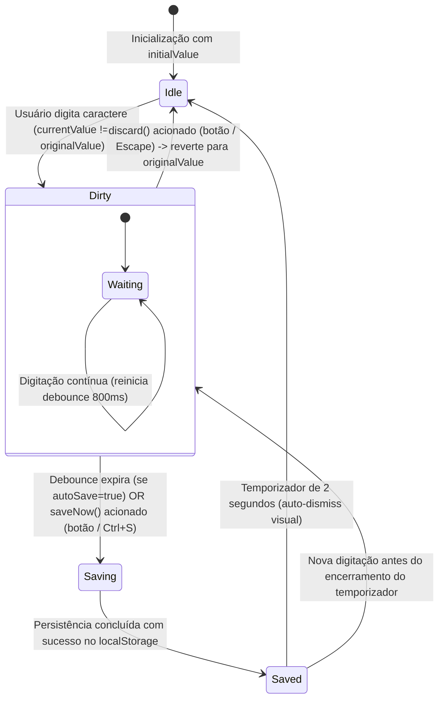

# Data Model: Salvamento Manual e Automático de Comentários e Campos da Tarefa

**Feature Branch**: `032-task-comment-autosave`  
**Date**: 2026-09-18  
**Spec**: [`specs/032-task-comment-autosave/spec.md`](spec.md)

---

## 1. Extensão do Modelo de Preferências (`AppSettings`)

Arquivo: `src/types/workspace.ts`

```typescript
export interface AppSettings {
  /** Tema visual ativo */
  theme: 'dark' | 'light' | 'slate' | 'neutral';
  /** Densidade espacial dos cartões e colunas */
  density: 'compact' | 'comfortable';
  /** Visualização inicial padrão */
  defaultView?: 'board' | 'workspaces' | 'analytics' | 'manage' | 'settings';
  /** Limite de Trabalho em Progresso (WIP) padrão sugerido para novas colunas */
  defaultWipLimit: number;
  /** Habilitação de micro-animações visuais */
  enableAnimations: boolean;
  /** Exibir alertas visuais de estouro de WIP */
  showWipLimits?: boolean;
  /** Exibir badges de tempo de ciclo nos cartões */
  showCycleTimeBadges?: boolean;
  /** ID do quadro padrão ao iniciar a aplicação (opcional) */
  defaultBoardId?: string;
  /**
   * Determina se comentários e campos textuais da tarefa salvam automaticamente (true)
   * ou se exigem confirmação manual pelo botão/atalho Ctrl+S (false).
   * Padrão: true.
   */
  autoSaveComments?: boolean;
  /**
   * Intervalo de debounce em milissegundos para gravação automática após digitação.
   * Padrão: 800ms.
   */
  autoSaveDebounceMs?: number;
  /** Data da última sincronização de configurações */
  updatedAt: string;
}
```

### Valores Padrão em `DEFAULT_APP_SETTINGS`:
```typescript
export const DEFAULT_APP_SETTINGS: AppSettings = {
  theme: 'dark',
  density: 'comfortable',
  defaultWipLimit: 5,
  enableAnimations: true,
  autoSaveComments: true,
  autoSaveDebounceMs: 800,
  updatedAt: new Date().toISOString(),
};
```

---

## 2. Tipos de Estado de Edição de Campo (`FieldEditState`)

Arquivo: `src/types/taskEdit.ts`

```typescript
/**
 * Estados do ciclo de vida da persistência de um campo textual editável.
 */
export type FieldEditStatus = 'idle' | 'dirty' | 'saving' | 'saved';

/**
 * Estado encapsulado de controle de edição para um campo textual.
 */
export interface FieldEditState<T = string> {
  /** Valor original carregado antes de qualquer alteração na sessão de edição */
  originalValue: T;
  /** Valor atual em edição no input/textarea */
  currentValue: T;
  /** Flag booleana indicando se o valor atual difere do valor original */
  isDirty: boolean;
  /** Indicador visual do status da persistência */
  status: FieldEditStatus;
}

/**
 * Opções de configuração do hook useFieldEdit.
 */
export interface UseFieldEditOptions<T = string> {
  /** Valor inicial recebido da entidade de domínio (ex.: task.description) */
  initialValue: T;
  /** Callback executado para persistir o novo valor validado */
  onSave: (newValue: T) => void | Promise<void>;
  /** Se o modo de salvamento automático está ativado */
  autoSave?: boolean;
  /** Tempo de debounce em ms (default: 800ms) */
  debounceMs?: number;
  /** Se o campo está em modo somente leitura (perfil guest) */
  isReadOnly?: boolean;
}

/**
 * Retorno público do hook useFieldEdit para integração no JSX.
 */
export interface UseFieldEditReturn<T = string> {
  value: T;
  setValue: (value: T) => void;
  isDirty: boolean;
  status: FieldEditStatus;
  saveNow: () => void;
  discard: () => void;
  handleKeyDown: (e: React.KeyboardEvent<HTMLElement>) => void;
  handleBlur: () => void;
}
```

---

## 3. Estado de Proteção de Fechamento do Modal (`TaskDetailsModalGuardState`)

```typescript
export type ModalUnsavedChangesAction = 'save_and_close' | 'discard_and_close' | 'continue_editing';

export interface UnsavedChangesModalState {
  isOpen: boolean;
  fieldLabels: string[];
}
```

---

## 4. Diagrama de Transição de Estados de Persistência


