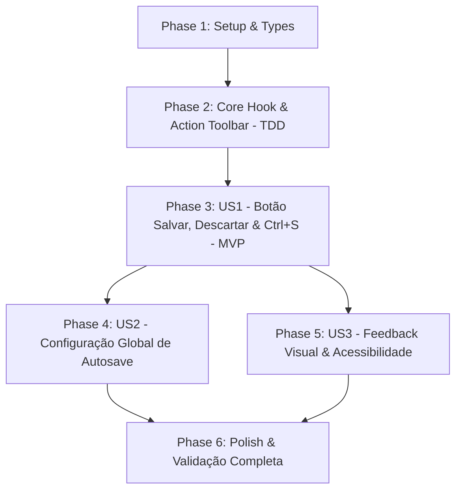

# Tasks: Salvamento Manual e Automático de Comentários e Campos da Tarefa

**Input**: Design documents from `specs/032-task-comment-autosave/` (`spec.md`, `plan.md`, `research.md`, `data-model.md`, `contracts/task-comment-autosave.contract.md`, `quickstart.md`, `checklists/requirements.md`)  
**Feature Branch**: `032-task-comment-autosave`  
**Prerequisites**: `plan.md`, `spec.md`, `data-model.md`, `contracts/task-comment-autosave.contract.md`, `quickstart.md`, `constitution.md` (v1.5.0)  
**Tests**: Todas as fases contêm tarefas de testes automatizados com Vitest e React Testing Library para garantir conformidade estrita com a Constituição III.  
**Organization**: As tarefas são agrupadas por fases e histórias de usuário (US1 a US3) em ordem estrita de prioridade para entrega incremental.

## Format: `[TaskID] [P?] [Story] Description with file path`

- **Checkbox**: Formato `- [ ]` do markdown
- **[P]**: Tarefa executável em paralelo (arquivos independentes e sem bloqueios)
- **[Story]**: História de usuário mapeada (`[US1]`, `[US2]`, `[US3]`)
- Caminhos absolutos/relativos exatos incluídos em cada descrição de tarefa.

---

## 🧠 Modelos de Raciocínio Analítico Pré-Tarefas (Mandatório)

> **Regra Constitucional VI (INEGOCIÁVEL):** Nenhuma tarefa de implementação pode ser executada sem a prévia formalização e documentação dos 6 modelos analíticos a seguir.

### 1. Decomposição por Primeiros Princípios (First-Principles Thinking)
- **Verdades fundamentais e invariantes:**
  - *Invariante de Integridade dos Dados da Tarefa*: A gravação de comentários, notas, critérios de aceitação ou cenários de testes altera apenas o payload textual da tarefa e seu timestamp `updatedAt`. Não pode provocar movimentação involuntária de coluna, reset de prioridade, descarte de tags ou distorção de Lead Time / Cycle Time.
  - *Invariante de Intencionalidade do Usuário*: Se o modo de salvamento automático estiver desativado (`autoSaveComments = false`), o sistema nunca deve persistir silenciosamente edições não confirmadas. No entanto, o usuário nunca deve perder edições por acidente (fechamento inadvertido de modal ou clique fora).
  - *Invariante de Interceptação de Atalho*: O atalho `Ctrl+S` / `Cmd+S` no contexto de um campo de texto de tarefa pertence ao Metrik, devendo acionar a persistência local e prevenir o diálogo nativo do sistema operacional ou navegador (`event.preventDefault()`).
  - *Invariante Local-First (Constituição VIII)*: Toda a persistência de preferências e campos opera autonomamente em `localStorage` sem depender de chamadas síncronas de rede.
- **Premissas acidentais descartadas:**
  - Descartada a premissa de que a perda de foco (`onBlur`) deve sempre forçar salvamento no modo manual: no modo manual, o usuário precisa ter controle explícito para cancelar (`Escape`/Descartar) ou confirmar (`Ctrl+S`/Salvar).
  - Descartada a premissa de que cada campo de texto deve reimplementar sua própria lógica de debounce e estado dirty: um hook centralizado e testado (`useFieldEdit`) garante consistência em todo o produto.

### 2. Análise Pré-Mortem & Inversão (Premortem & Inversion)
- **Cenários de falha antecipados:**
  - *Falha 1: Diálogo nativo do navegador "Salvar página como..." abre ao pressionar Ctrl+S*: Se o preventDefault não for chamado adequadamente no `onKeyDown`, o navegador exibe o popup do sistema de arquivos e desvia o foco do usuário.
  - *Falha 2: Concorrência de digitação com timer de debounce gerando sobrescrita de texto*: Se o usuário continuar digitando enquanto um timer expira, texto recém-digitado pode ser perdido ou sobreposto.
  - *Falha 3: Fechamento acidental do modal no modo manual*: O usuário digita 3 parágrafos de notas, clica fora da janela modal e perde todo o texto porque não havia guarda de dirty state.
  - *Falha 4: Degradação de desempenho por re-render do quadro Kanban a cada tecla*: Se o estado do texto subir para o componente `Board` a cada caractere, cartões vizinhos re-renderizam desnecessariamente.
- **Mitigações desenhadas nas tarefas:**
  - A tarefa T003/T004 implementa no hook `useFieldEdit` a interceptação segura de `(e.ctrlKey || e.metaKey) && e.key === 's'`, chamando `preventDefault` e `stopPropagation`.
  - A tarefa T004 cancela o timer anterior do debounce antes de reagendar a cada chamada de `setValue`, garantindo persistência atômica do valor mais recente.
  - A tarefa T010/T011 implementa o diálogo de proteção de fechamento para impedir perda de rascunhos pendentes.
  - O estado efêmero de digitação reside localmente no hook `useFieldEdit`, notificando o container da tarefa e o board apenas na confirmação de gravação (`onSave`).

### 3. Validação MECE (Mutually Exclusive, Collectively Exhaustive)
- **Exclusividade Mútua (Zero Duplicação):**
  - `src/types/taskEdit.ts` define apenas os tipos e interfaces de edição de campo.
  - `useFieldEdit.ts` gerencia exclusivamente o ciclo de vida da edição, dirty tracking e timer de debounce.
  - `TaskFieldActionToolbar.tsx` renderiza apenas a barra visual com status e botões de ação.
  - `GeneralSettingsTab.tsx` expõe apenas o interruptor de configuração.
  - `Task.tsx` e `TaskDetailsModal.tsx` consomem o hook e a toolbar sem duplicar código de controle.
- **Exaustão Coletiva (Cobertura 100%):**
  - Todos os requisitos funcionais (FR-001 até FR-013) e critérios de aceitação das User Stories 1, 2 e 3 possuem cobertura direta nas tarefas planejadas.

### 4. Árvore de Decisão & Poda de Alternativas (Tree of Thoughts)
- **Caminhos de arquitetura avaliados:**
  - *Alternativa A*: Salvar tudo exclusivamente no evento `onBlur` sem botões ou feedback visual.  
    *Poda*: Descartada por violar diretamente a solicitação do usuário e os requisitos funcionais FR-001 e FR-002.
  - *Alternativa B*: Gravar no `localStorage` a cada tecla digitada sem debounce.  
    *Poda*: Descartada por causar excesso de I/O no disco e potenciais travamentos na thread principal de renderização.
  - *Alternativa C (Escolhida)*: Hook unificado `useFieldEdit` com debounce inteligente de 800ms, botões Salvar/Descartar dedicados, atalho universal `Ctrl+S`, micro-indicador de 3 estados e interruptor global em Configurações.

### 5. Critério de Falsificabilidade & TDD (Red-Bar First)
- **Falha demonstrável (Red Bar):**
  - Os testes em `tests/unit/useFieldEdit.test.ts`, `tests/unit/TaskFieldActionToolbar.test.tsx`, `tests/unit/TaskAutosave.test.tsx`, `tests/unit/TaskDetailsModalAutosave.test.tsx` e `tests/unit/GeneralSettingsAutosave.test.tsx` devem ser executados primeiro e falhar antes da codificação dos respectivos componentes.
- **Critério determinístico de aceite (Green Bar):**
  - Todos os novos testes unitários passam com 100% de sucesso.
  - A suíte completa da aplicação (`npm test -- --run`) mantém 0 falhas em todos os arquivos de teste.
  - O bundle de produção (`npm run build`) compila sem erros com código 0.

### 6. Triangulação Adversarial & Conformidade Constitucional
- **Constituição I (Spec-Driven)**: Especificação, checklist, plano, modelo e contratos validados.
- **Constituição II (Qualidade & Modularidade)**: Isolamento do hook `useFieldEdit` e toolbar `TaskFieldActionToolbar`.
- **Constituição III (Verificação Automatizada)**: 5 suítes de testes unitários dedicadas no Vitest.
- **Constituição IV (Observabilidade)**: Mensagens e diagnósticos consistentes com prefixo `[Metrik]`.
- **Constituição V (Simplicidade & YAGNI)**: Zero bibliotecas npm externas adicionadas.
- **Constituição VII (Independência de Marca)**: Auditoria explícita (T018) para certificar zero menção a marcas proprietárias de terceiros.
- **Constituição VIII (Local-First)**: Preservação da autoridade local e respeito ao modo somente leitura para convidados.

---

## Phase 1: Setup (Shared Types & Settings)

**Purpose**: Definições de tipos TypeScript para controle de edição, estados de persistência e extensão de `AppSettings`.

- [x] T001 [P] Criar definições de tipos para controle de edição de campos (`FieldEditStatus`, `FieldEditState`, `UseFieldEditOptions`, `UseFieldEditReturn`) em `src/types/taskEdit.ts`
- [x] T002 [P] Atualizar modelo de dados `AppSettings` em `src/types/workspace.ts` e valores padrão em `src/hooks/useAppSettings.ts` com `autoSaveComments: boolean` e `autoSaveDebounceMs: number`

---

## Phase 2: Foundational (Core Hook & Action Toolbar - TDD)

**Purpose**: Implementar o hook universal de edição e o componente visual da barra de ações com abordagem estrita de TDD.

- [x] T003 [P] Criar teste unitário TDD para o hook `useFieldEdit` cobrindo dirty tracking, debounce de 800ms, saveNow, discard, interceptação de `Ctrl+S` e tecla `Escape` em `tests/unit/useFieldEdit.test.ts`
- [x] T004 Implementar o hook universal `useFieldEdit` em `src/hooks/useFieldEdit.ts`
- [x] T005 [P] Criar teste unitário para o componente `TaskFieldActionToolbar` cobrindo renderização de estados ('idle', 'dirty', 'saving', 'saved'), botões de ação e acessibilidade em `tests/unit/TaskFieldActionToolbar.test.tsx`
- [x] T006 Implementar componente visual `TaskFieldActionToolbar` e estilos responsivos em `src/components/TaskFieldActionToolbar.tsx` e `src/components/TaskFieldActionToolbar.css`

**Checkpoint**: Núcleo de controle de edição e barra de ações testados e aprovados com 100% de testes verdes.

---

## Phase 3: User Story 1 - Botões Salvar/Descartar e Atalho Ctrl+S nos Cartões e Modal (Priority: P1) 🎯 MVP

**Goal**: Disponibilizar botões dedicados de "Salvar" e "Descartar", atalho universal `Ctrl+S` / `Cmd+S`, micro-indicadores visuais de status e proteção contra fechamento não salvo no modal.

**Independent Test**: Abrir cartão ou modal de detalhes, editar a descrição ou critérios de aceitação, verificar o surgimento do botão Salvar e do indicador "Alterações não salvas", salvar via clique ou `Ctrl+S` e constatar a gravação imediata sem abrir popups do navegador.

### Tests for User Story 1 ⚠️

- [x] T007 [P] [US1] Criar testes unitários para persistência e atalho Ctrl+S nos campos de texto do cartão em `tests/unit/TaskAutosave.test.tsx`
- [x] T008 [P] [US1] Criar testes unitários para persistência, atalho Ctrl+S e guarda de fechamento no modal em `tests/unit/TaskDetailsModalAutosave.test.tsx`

### Implementation for User Story 1

- [x] T009 [US1] Atualizar `src/components/Task.tsx` integrando `useFieldEdit` e `TaskFieldActionToolbar` nos campos editáveis (Título, Critérios de Aceitação e Cenários de Testes)
- [x] T010 [US1] Atualizar `src/components/TaskDetailsModal.tsx` integrando `useFieldEdit`, `TaskFieldActionToolbar` e guarda de fechamento com diálogo de confirmação para alterações não salvas
- [x] T011 [US1] Adicionar estilos CSS para o diálogo de guarda de saída com alterações pendentes em `src/components/TaskDetailsModal.css`
- [x] T012 [US1] Propagar `settings.autoSaveComments` de `src/App.tsx` para os componentes `Task` e `TaskDetailsModal`

**Checkpoint**: MVP concluído! Botões Salvar/Descartar, atalho `Ctrl+S` e guarda de fechamento funcionando plenamente no cartão e no modal.

---

## Phase 4: User Story 2 - Configuração Global de Salvamento Automático (Priority: P2)

**Goal**: Fornecer interruptor na tela de Configurações para habilitar ou desabilitar o salvamento automático de comentários e campos de texto em todo o sistema.

**Independent Test**: Acessar Configurações -> Geral, desativar o switch de salvamento automático, voltar ao quadro, comprovar que digitação não salva automaticamente e que apenas o clique em "Salvar" ou `Ctrl+S` grava as alterações.

### Tests for User Story 2 ⚠️

- [x] T013 [P] [US2] Criar teste unitário para alternância do interruptor de autosave na tela de configurações em `tests/unit/GeneralSettingsAutosave.test.tsx`

### Implementation for User Story 2

- [x] T014 [US2] Implementar interruptor (toggle switch) para "Salvar automaticamente comentários e campos de texto" na aba Geral em `src/components/Settings/GeneralSettingsTab.tsx`
- [x] T015 [US2] Validar e assegurar a reatividade instantânea da alteração de `autoSaveComments` entre a aba Configurações e o Kanban através de `src/App.tsx`

**Checkpoint**: Configuração global operacional, permitindo alternar livremente entre modo automático (debounce 800ms) e modo manual (botão / `Ctrl+S`).

---

## Phase 5: User Story 3 - Feedback Visual Empírico e Acessibilidade (Priority: P3)

**Goal**: Garantir excelência visual com transições suaves do indicador ("✓ Salvo" fade-out após 2s), acessibilidade com leitores de tela (`aria-live="polite"`) e documentação dos atalhos de teclado.

**Independent Test**: Salvar uma edição, observar a transição suave de "Salvando..." para "✓ Salvo" e o desvanecimento após 2 segundos; navegar pelos botões via teclado Tab/Enter.

### Implementation for User Story 3

- [x] T016 [P] [US3] Implementar micro-animações de pulso ("Salvando...") e fade-out suave após 2s ("✓ Salvo") em `src/components/TaskFieldActionToolbar.css`
- [x] T017 [US3] Garantir conformidade de acessibilidade WCAG 2.1 AA (`aria-live="polite"`, `aria-label`, foco visível e tooltips informativos com as teclas `Ctrl+S` e `Esc`) em `src/components/TaskFieldActionToolbar.tsx`

---

## Phase 6: Polish & Cross-Cutting Concerns

**Purpose**: Auditoria de marca, testes de regressão de toda a aplicação e compilação de produção.

- [x] T018 [P] Realizar auditoria rigorosa de conformidade com o Princípio VII da Constituição (Brand Independence): certificar zero menção a marcas proprietárias de terceiros em código, comentários, atributos DOM e UI
- [x] T019 Executar suíte completa de testes automatizados (`npm test -- --run`) e compilação estrita do bundle de produção (`npm run build`) assegurando 100% de aprovação e zero erros

---

## Dependencies & Execution Order

---

## Parallel Opportunities

- **Fase 1 (Setup)**: T001 e T002 podem ser executadas em paralelo (arquivos independentes de tipos).
- **Fase 2 (Foundational TDD)**: T003 (teste do hook) precede T004 (implementação do hook); T005 (teste da toolbar) precede T006 (implementação da toolbar). T003 e T005 podem ser iniciadas em paralelo.
- **Fase 3 (US1 Tests & Implementation)**: T007 e T008 (testes unitários do cartão e do modal) podem rodar em paralelo antes de T009 e T010.
- **Fase 4 (US2 Settings)**: T013 (teste da aba de configurações) precede T014 (implementação do switch).
- **Fase 5 (US3 Polish & A11y)**: T016 (CSS de micro-animações) e T017 (acessibilidade ARIA) podem rodar em paralelo.
- **Fase 6 (Cross-Cutting)**: T018 (auditoria de marca) pode rodar em paralelo antes de T019 (validação total de testes e build).

---

## Implementation Strategy

### MVP First (User Story 1 Only)
1. Concluir Fase 1 (Setup: Tipos `taskEdit.ts` e extensão de `AppSettings`).
2. Concluir Fase 2 (Foundational: Hook universal `useFieldEdit.ts` e componente `TaskFieldActionToolbar.tsx` via TDD).
3. Concluir Fase 3 (US1: Integração nos cartões `Task.tsx` e modal `TaskDetailsModal.tsx`, suporte a `Ctrl+S` / `Cmd+S`, botões Salvar/Descartar e guarda de alterações pendentes no modal).
4. **Validar MVP**: Abrir cartão e modal, testar edição manual, salvar via botão e via `Ctrl+S`, descartar via `Escape` e verificar que não há abertura do popup de salvar do navegador.

### Incremental Delivery
1. **Incremento 1**: MVP totalmente funcional com botões dedicados de salvar/descartar, atalho universal `Ctrl+S` e feedback visual nos cartões e no modal.
2. **Incremento 2**: Interruptor global na tela de Configurações (`autoSaveComments: boolean`) com efeito imediato e persistência local (US2).
3. **Incremento 3**: Micro-animações refinadas, auto-dismiss de 2s e acessibilidade WCAG 2.1 AA (`aria-live="polite"`, foco visível) (US3).
4. **Incremento Final**: Auditoria rigorosa de marca (Constituição VII) e execução da suíte completa de testes (`npm run test`) e compilação de produção (`npm run build`).
