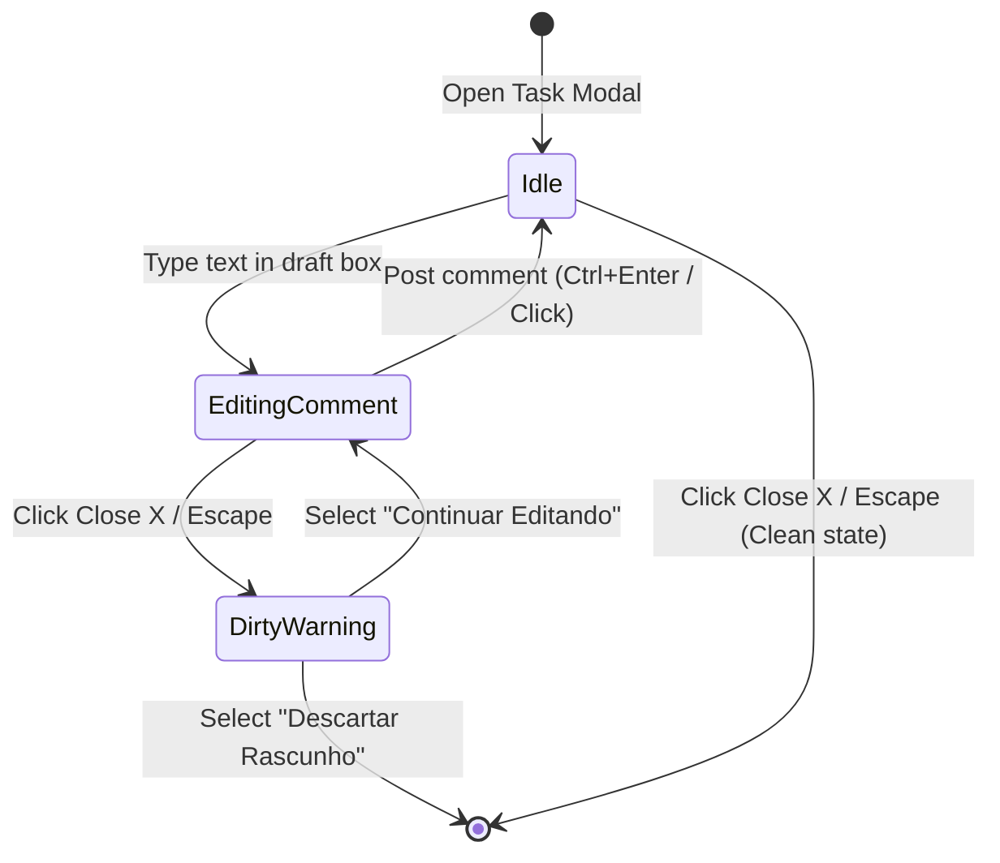

# Data Model: Task Details Modal & Activity System UI/UX Redesign

**Feature Branch**: `036-task-details-modal-redesign`  
**Date**: 2026-09-22  
**Spec**: [spec.md](./spec.md)  

---

## 1. Domain Entities & State Models

### 1.1 UserTimelinePreferences (LocalStorage Schema)
Represents global browser preferences for timeline visualization, filter state, and density.

```typescript
export interface UserTimelinePreferences {
  /** Schema version for migration safety */
  version: number;

  /** Visual density mode for activity items */
  densityMode: 'detailed' | 'compact';

  /** Currently selected timeline filter tab */
  activeFilter: 'all' | 'decisions' | 'comments' | 'activity';

  /** Search query string for filtering activities in real-time */
  searchQuery: string;
}
```

- **Persistence Key**: `metrik-timeline-prefs` in `localStorage`
- **Default Value**:
  ```typescript
  {
    version: 1,
    densityMode: 'detailed',
    activeFilter: 'all',
    searchQuery: ''
  }
  ```
- **Validation Rules**:
  - `densityMode` MUST be either `'detailed'` or `'compact'`.
  - `activeFilter` MUST be one of `'all'`, `'decisions'`, `'comments'`, `'activity'`.

---

### 1.2 TaskDetailsModalState (Component Local State)
Represents the runtime UI state of the task details modal.

```typescript
export interface TaskDetailsModalState {
  /** Active task ID being edited or viewed */
  taskId: string | null;

  /** Current draft text in the comment creation form */
  draftCommentText: string;

  /** Flag indicating whether the comment draft is marked as a Project Decision */
  draftIsDecision: boolean;

  /** Visual dirty state indicator (true if draftCommentText.trim().length > 0) */
  isDraftDirty: boolean;

  /** Active confirmation modal state for dirty draft warning on close */
  showDirtyConfirmDialog: boolean;

  /** Collapsed/expanded state for sidebar metadata panel on tablet/mobile */
  isSidebarCollapsedMobile: boolean;
}
```

---

### 1.3 TaskComment (Existing Model — 100% Retrocompatible)
Represents a user-created comment or decision entry.

```typescript
export interface TaskComment {
  id: string;
  taskId: string;
  userId: string;
  userName: string;
  text: string;
  isDecision?: boolean;
  pinned?: boolean;
  createdAt: string;
}
```

---

### 1.4 TaskActivityLog (Existing Model — 100% Retrocompatible)
Represents a system audit event.

```typescript
export interface TaskActivityLog {
  id: string;
  taskId: string;
  userId: string;
  userName: string;
  eventType: TaskActivityEventType;
  description: string;
  fromValue?: string;
  toValue?: string;
  timestamp: string;
}
```

---

## 2. State Transitions & Invariants



### Invariants
1. **Dirty Draft Guard**: If `draftCommentText.trim().length > 0`, closing the modal MUST trigger `showDirtyConfirmDialog = true`.
2. **Global Preference Sovereignty**: Changes to `densityMode` or `activeFilter` update `metrik-timeline-prefs` immediately in `localStorage` and trigger reactivity in all open timeline components.
